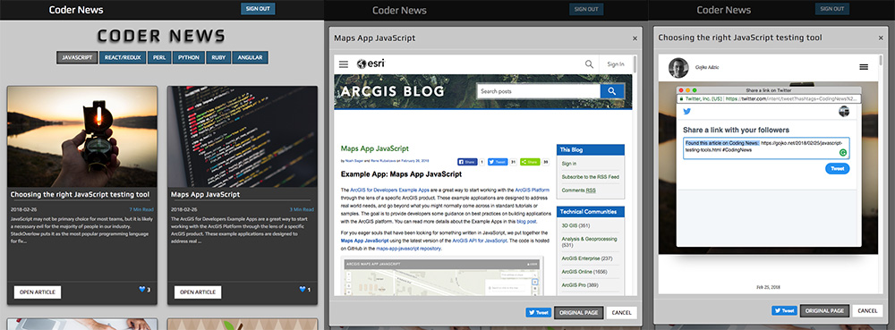

<h1>Coder News</h1>
<p><a href="http://codernews-react-capstone.herokuapp.com/">Coder News</a> is a responsive full-stack application that allows users to read the latest articles about the most popular programming languages.  The app uses the HackerNews API to find the articles before individually scraping each articles website to provide enough data to display on the app's React front end.</p>


## Getting started
### Installing
```
>   git clone https://github.com/Bushmb/codernews-react-capstone.git
>   cd codernews-react-capstone
>   npm install
```
### Launching
The app requires both the server and front end to be running to work.  

To enable the server:
```
>   npm start
```

To enable the front end client:
```
>   cd client
>   npm start
```
Then open [`localhost:3000`](http://localhost:3000) in a browser if a window is not automatically opened for you.


<h2>Introduction</h2>
<p>Coder News was designed to be a simple way to read articles about the most popular programming languages. It starts with scouring Hacker News for news related to the top six programming topics, including Javascript, React/Redux and Angular. Coder News follows the links and scrapes the data for you. What you are left with is an easy to read collection of articles to read without ever needing to leave the site. If you want to tell the rest of the world about a specific article, you can log into Twitter and Tweet away!</p>

<h2>How it Works</h2>
<h3>Automated Data Gathering</h3>
<p>Coder News uses a seperate server which runs a search every 15 minutes using the HackerNews API to gather the most recent articles posted about 6 different programming languages: JavaScript, React/Redux, Perl, Python, Ruby, and Angular.  Using the links found in the articles, the server then attempts to individually scrape each website seperately and stores that information in a database keeping enough data to fill out the apps front end.</p>
<h3>Choosing a topic</h3>
<p>Once logged into the app, users are able to choose from one of the six different topics and are presented with a list of cards showing the relevant data gathered from each website, including a image if one was available, the articles headline, date it was posted on HackerNews, a small introduction to the article, as well as an approximate time it should take to read the full story using a formula of total words divided by typical words per minute reading speed.</p>
<h3>Viewing the full article</h3>
<p>If the user chooses to view the full article, they can click on the "Open Article" button on each card and a modal will open which contains an iframe element which displays the article's full website.</p>
<h3>Tweeting</h3>
<p>If the user wishes to share the article, they can click on the Twitter button on the bottom of each modal which will allow them to use their connected twitter account to send out a tweet. The subject of the tweet is already prefilled with the articles link and a relevant hashtag, but the user is free to change or add to this to provide more information should they choose.</p>

<h2>Technology</h2>
<h3>Front End</h3>
<ul>
  <li>React & Redux</li>
  <li>HTML5</li>
  <li>CSS3</li>
  <li>JavaScript</li>
  <li>jQuery</li>
</ul>
<h3>Back End</h3>
<ul>
  <li>Node.js + Express.js (web server)</li>
  <li>MongoDB (database)</li>
</ul>
<h3>Seperate (always-on) Server
<ul>
  <li>Node.js + Express.js (web server)</li>
  <li>MongoDB (database)</li>
</ul>
<h3>Responsive</h3>
<ul>
  <li>The app is fully responsive and quickly adapts to all mobile, tablet, and desktop viewports.</li>
</ul>
<h3>Security</h3>
<ul>
  <li>Coder News connects to the Firebase SDK to carry out the sign-in flow, enabling users to connect to their Twitter accounts to share any articles they enjoy.</li>
</ul>